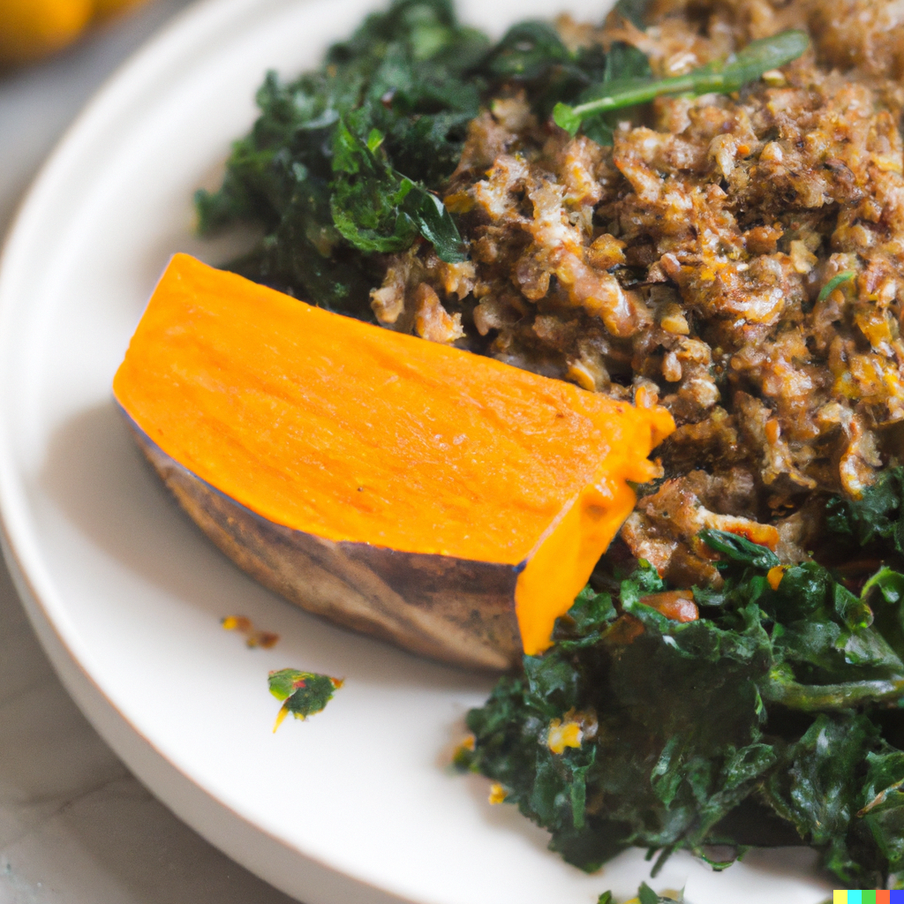

### The Benefits of Buckwheat

Buckwheat groats are rich in unique exogenous amino acids - especially in lysine, which our body does not produce itself, but must be supplied with through food. Lysine is essential in building proteins, especially ones stored in muscles and bones. 

Buckwheat is a great source of protein (it contains approximately 10 to 16 percent). The protein from buckwheat is better absorbed than that derived from cereals, it has a similar value as legume protein. Buckwheat also regulates blood pressure and has potential anti-cancer effects.

> ###### Serves: 2
>
> ###### Cooking Time: 40 mins.

#### Ingredients:

* 350g Butternut Squash (Or Sweet Potatoes)
* 100g Buckwheat Groats
* 1 Tablespoon of Soy Sauce (Plain)
* 4 Kale Leaves
* 1 Tablespoon of Olive Oil
* 1 Small Onion
* 1 Clove of Garlic
* ½  Teaspoon Dried Thyme
* ½  Chilli Pepper
* 2 Teaspoons of Balsamic Vinegar
* 50g of Feta Cheese
* Salt & Pepper (To Season)

1. Peel the pumpkin, cut into small cubes, season with salt and pepper. Fry in a pan with a non-stick bottom using a tablespoon of olive oil, for about 10 minutes stirring, or place on a baking tray lined with paper and bake for about 20 minutes at 200°C.
2. Boil the buckwheat in slightly salted water, with enough water to cover the groats in a saucepan, on a low heat for about 10 - 20 minutes.
3. Once cooked, leave covered for another 5 - 10 minutes.* Afterwards, drain the groats and place them into a bowl, then mix with the soy sauce.
4. Wash the kale, tear off the soft leaves from the hard part in the middle, chop, put in boiling water for a minute, drain.
5. Pour the olive oil into the pan, sauté the diced onion. Add sliced garlic and thyme, fry for a minute.
6. Add the buckwheat groats, chilli pepper and fry, stirring, for half a minute. Then add the fried or baked pumpkin and finally the kale. Stir, add balsamic vinegar and fry for another 1 - 2 minutes. Sprinkle the dish with feta cheese at the end.

##### Things to keep in mind:

∗ Cook the groats in the ratio of 1 cup of groats to 3 to 4 cups of liquid. The less liquid, the more perceptible and hard the groats. However, the more liquid we add, the groats will be soft and tender.

##### Vegan Alternative:

For a vegan version of this dish, you can use green olives instead of feta cheese.