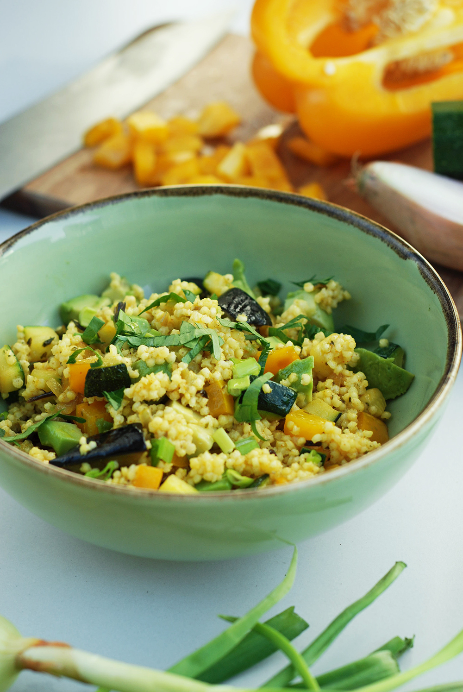

### The Benefits of Millet Oats

Millet oats contain vitamin E, various B vitamins and lecithin (a mixture of fats that are essential to cells in the human body). It is the perfect gluten-free alternative as it does not contain gluten. Additionally, it provides the body with silicon, which is responsible for healthy joints, strong hair and nails, and proper metabolism. It is easily digestible and well absorbed. It can be served in many ways and it is delicious every time!

> ###### Serves: 2
>
> ###### Cooking Time: 25 mins.

#### Ingredients:

* ⅓ Cup (80ml) of Millet Groats
* 2 Tablespoons of Olive Oil
* 1 Zucchini
* 1 Clove of Garlic
* 1 Tomato
* ¼ Onion
* Basil or Arugula
* ½ Teaspoon of Ground Turmeric 
* ½ Teaspoon of Sweet Paprika 
* ½ Teaspoon of Dried Oregano
* A Piece of Chili Pepper (Optional)

1. Cook the millet with enough water to cover the groats in a saucepan, on a low heat for about 10 - 20 minutes.
2. Once cooked, leave covered for another 5 - 10 minutes.*
3. In a frying pan, fry the diced zucchini in 1 tablespoon of olive oil until browned, stir occasionally, season with salt and pepper.
4. Add the crushed garlic and fry for a while, stirring. Add spices and cooked millet. Stir fry for about 2 minutes.
5. Put on a plate, add chopped tomatoes, season with salt and pepper, sprinkle with chopped onion, chopped pepper and basil or arugula. Drizzle the remaining olive oil.

##### Things to keep in mind:

∗ Cook the groats in the ratio of 1 cup of groats to 3 to 4 cups of liquid. The less liquid, the more perceptible and hard the groats. However, the more liquid we add, the groats will be soft and tender.