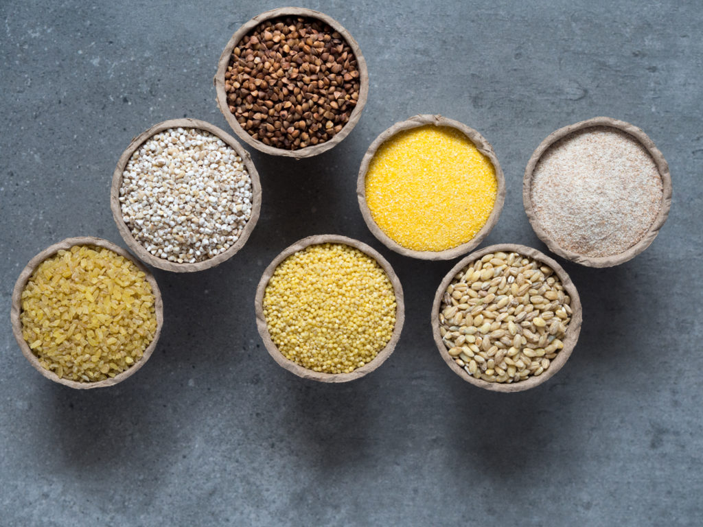

Groats, i.e. products obtained from cereal grains (completely or partially dehusked, and sometimes also ground), should be one of the main sources of carbohydrates in a balanced diet. One time of groats in particular - Buckwheat, is a very good source of protein. The complex carbohydrates groats can provide energy for a longer period of time, for instance, in comparison to the commonly used rice. Depending on the type of grain or pseudo-cereal the groats were made from, they are characterised by different content of minerals, vitamins and fibre. Among others, groats are rich in:

* Potassium
* Phosphorus
* Zinc
* Magnesium
* Iron
* B vitamins (B1, B2, B6)

Groats should be part of a healthy and balanced diet - they are characterised by high nutritional density, a wealth of vitamins and minerals. They can be used to prepare many dishes, both savoury and sweet. The link below will redirect you to recipes for delicious and, more importantly, nutritious dishes made from groats - the kitchen’s understatement.